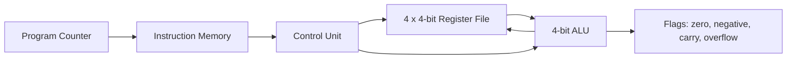

# Verilog Mini CPU

A compact 4-bit educational CPU written in Verilog. The design includes a register file, ALU, control unit, program counter, instruction memory, ALU flags, waveform generation, and self-checking testbenches.

This project is intentionally small enough to study in one sitting while still demonstrating the structure of a real hardware-design workflow: modular RTL, instruction decode, simulation, verification, and reproducible builds.

## Architecture



The CPU executes one instruction per clock when `run_enable` is high:

1. `pc` selects a 16-bit instruction from instruction memory.
2. The control unit decodes opcode, destination register, source registers, and immediate mode.
3. The register file provides operands.
4. The ALU computes the result and flags.
5. The result is written back to the destination register.
6. The program counter increments.

## Instruction Format

Each instruction is 16 bits:

| Bits | Field | Description |
|------|-------|-------------|
| `[15:13]` | `opcode` | ALU operation |
| `[12:11]` | `dest` | Destination register |
| `[10:9]` | `src_a` | First source register |
| `[8:7]` | `src_b` | Second source register |
| `[6]` | `use_immediate` | Selects immediate instead of `src_b` |
| `[5:4]` | reserved | Reserved for future control bits |
| `[3:0]` | `immediate` | 4-bit immediate operand |

## ALU Operations

| Opcode | Operation | Description |
|--------|-----------|-------------|
| `000` | `ADD` | `A + B` |
| `001` | `SUB` | `A - B` |
| `010` | `AND` | Bitwise AND |
| `011` | `OR` | Bitwise OR |
| `100` | `XOR` | Bitwise XOR |
| `101` | `SLL` | Logical left shift by `B[1:0]` |
| `110` | `SRL` | Logical right shift by `B[1:0]` |
| `111` | `SLT` | Unsigned set-less-than |

The ALU exposes four flags:

| Flag | Meaning |
|------|---------|
| `zero` | Result is `0000` |
| `negative` | Result bit 3 is set |
| `carry` | ADD carry-out, SUB borrow, or shifted-out bit |
| `overflow` | Signed overflow for ADD/SUB |

## Project Structure

```text
.
├── src/
│   ├── alu.v
│   ├── control_unit.v
│   ├── instruction_memory.v
│   ├── register_file.v
│   └── top.v
├── tb/
│   ├── alu_tb.v
│   ├── register_file_tb.v
│   └── top_tb.v
├── Makefile
├── README.md
└── LICENSE
```

## Verification

The test suite uses self-checking Verilog testbenches:

| Testbench | Coverage |
|-----------|----------|
| `alu_tb.v` | ALU operations and flags |
| `register_file_tb.v` | Reset, writes, and asynchronous reads |
| `top_tb.v` | Instruction loading, register loading, PC stepping, ALU execution, and writeback |

The full-system test loads this short program:

```text
R2 = R0 + R1
R3 = R0 - R1
R2 = R2 & 8
R2 = R2 << 1
R3 = R0 < R1
```

## Running the Project

### Prerequisites

- [Icarus Verilog](https://steveicarus.github.io/iverilog/)
- [GTKWave](https://gtkwave.sourceforge.net/) for waveform inspection

### Run all tests

```bash
make test
```

Expected output:

```text
alu_tb: PASS
register_file_tb: PASS
top_tb: PASS
```

### Run individual tests

```bash
make test-alu
make test-register-file
make test-top
```

### View waveforms

The top-level testbench writes `waveform.vcd`.

```bash
make test-top
gtkwave waveform.vcd
```

### Clean generated files

```bash
make clean
```

## Project Highlights

This project demonstrates:

- RTL module decomposition
- ALU design and flag handling
- Register-file read/write behavior
- Instruction decoding
- Program-counter based execution
- Simulation-driven verification
- Make-based reproducible test runs


## License

Licensed under Apache-2.0. See [LICENSE](LICENSE).
